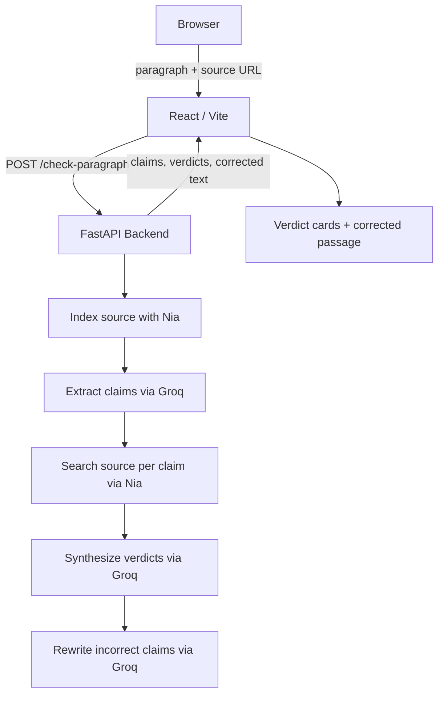

# SourceCheck

Paste research writing. Get back the truth, claim by claim.


SourceCheck is a fact verification tool for research writing. Drop in a passage, point it at a source paper, and it extracts every factual claim, checks each one against the actual paper via semantic search, and hands back a claim-by-claim audit alongside a corrected version of the text — fixing only what's wrong.

## Table of Contents
- [What It Does](#what-it-does)
- [The Problem](#the-problem)
- [How It Works](#how-it-works)
- [Demo](#demo)
- [Architecture](#architecture)
- [Tech Stack](#tech-stack)
- [Quick Start](#quick-start)
- [Local Setup](#local-setup)
- [API Reference](#api-reference)
- [Smoke Test](#smoke-test)

---

## What It Does

- **Claim extraction** — identifies the specific factual statements in a passage that are attributed to or checkable against a source
- **Semantic retrieval** — indexes the source paper with Nia and searches it per claim to find the most relevant evidence
- **Verdict per claim** — labels each extracted claim as `confirmed`, `incorrect`, `partially_correct`, `hallucinated_citation`, or `unverifiable`
- **Corrected rewrite** — rewrites only the claims that are wrong, preserving everything else in the original text
- **Structured audit** — returns a full breakdown with per-claim verdicts, evidence snippets, and a summary

---

## The Problem

Research writing is full of claims that are technically attributed to a source but aren't quite what the source says. A number is off. A finding is overstated. A concept is credited to the wrong paper. These errors are easy to introduce and hard to catch — reading and re-reading the original paper sentence by sentence doesn't scale, and most tools treat fact-checking as a binary pass/fail rather than a surgical, claim-level audit.

---

## How It Works

1. You provide a passage and a source URL (an arXiv paper, a PDF, a web resource)
2. SourceCheck indexes the source with Nia's retrieval API
3. A language model extracts the individual factual claims worth checking
4. Each claim is searched against the indexed source independently
5. A reasoning step synthesizes a verdict for every claim with evidence
6. The corrected passage is rewritten conservatively — only wrong claims change

The result is a structured audit you can read claim by claim, plus a drop-in replacement passage with the errors fixed.

---

## Demo

Try this passage against the GPT-4 Technical Report (`https://arxiv.org/abs/2303.08774`):

```text
A lot of technical reports are remembered for one or two headline facts, even though most of the document is really made up of setup, caveats, and evaluation framing. The GPT-4 Technical Report is similar in that sense: it spends a good amount of time explaining how the model is assessed and how its results should be interpreted. In the report, GPT-4 achieves 67.0% on the HumanEval coding benchmark in the 0-shot setting. The report also introduced the Transformer architecture in 2017, which later became the basis for GPT models. It additionally presents chain-of-thought prompting as a reasoning method first created by OpenAI in 2022. Beyond those points, much of the paper has the familiar texture of a serious research report, where the surrounding prose often matters for context more than for any single standalone claim.
```

Expected output:
- `3 claims extracted`
- `1 confirmed` — the HumanEval score is accurate
- `2 incorrect` — the Transformer and chain-of-thought attributions are wrong
- corrected paragraph rewrites only the two incorrect claims

---

## Architecture



### Key design decisions

- **Claim-level granularity** — verdicts are per-claim, not per-paragraph. A passage with one wrong sentence and four correct ones shouldn't fail wholesale
- **Conservative rewrite** — the corrected passage changes only claims that are verifiably wrong. Style, structure, and correct content are untouched
- **Nia for retrieval** — source documents are indexed once per job; each claim gets its own semantic search against the index rather than a single pass over the whole document
- **Structured Groq output** — extraction and verdict synthesis both use structured output schemas so the frontend can render typed claim cards without fragile parsing

---

## Tech Stack

### Frontend
- React + Vite
- Tailwind CSS
- WebGL background (Three.js)

### Backend
- FastAPI + Uvicorn
- Pydantic v2 (request/response schemas)
- httpx (async HTTP)

### AI & Retrieval
- **Nia** — semantic indexing and per-claim retrieval against source documents
- **Groq (LLaMA 3)** — claim extraction, verdict synthesis, and conservative rewrite

---

## Quick Start

```bash
# Backend
cd backend
python3 -m venv venv && source venv/bin/activate
pip install -r requirements.txt
cp .env.example .env
# add NIA_API_KEY and GROQ_API_KEY to backend/.env
uvicorn main:app --reload

# Frontend (separate terminal)
cd frontend
npm install
# create frontend/.env.local with VITE_API_URL=http://localhost:8000
npm run dev
```

Backend: `http://localhost:8000` — Frontend: `http://localhost:5173`

---

## Local Setup

### Backend

```bash
cd backend
python3 -m venv venv
source venv/bin/activate
pip install -r requirements.txt
cp .env.example .env
```

Add your keys to `backend/.env`:

```env
NIA_API_KEY=your_nia_api_key_here
GROQ_API_KEY=your_groq_api_key_here
```

```bash
uvicorn main:app --reload
```

API docs: `http://localhost:8000/docs`

### Frontend

```bash
cd frontend
npm install
```

Create `frontend/.env.local`:

```env
VITE_API_URL=http://localhost:8000
```

```bash
npm run dev
```

---

## API Reference

### `GET /health`

```json
{ "status": "ok" }
```

### `POST /check-paragraph`

Request:
```json
{
  "text": "In the report, GPT-4 achieves 67.0% on the HumanEval coding benchmark in the 0-shot setting.",
  "source_url": "https://arxiv.org/abs/2303.08774",
  "citation_hint": "GPT-4 Technical Report (2023)"
}
```

Response includes:
- `claims` — array of extracted claims with verdict, confidence, and evidence
- `summary` — confirmed / incorrect / unverifiable counts
- `original_text` — the passage as submitted
- `corrected_text` — rewritten passage with wrong claims fixed

---

## Smoke Test

With the backend running:

```bash
cd backend
SOURCECHECK_API_BASE=http://127.0.0.1:8000 python3 smoke_test.py
```

Note: repeated runs can hit Groq rate limits.

---

Built at SDxUCSD Agent Hackathon · 2026